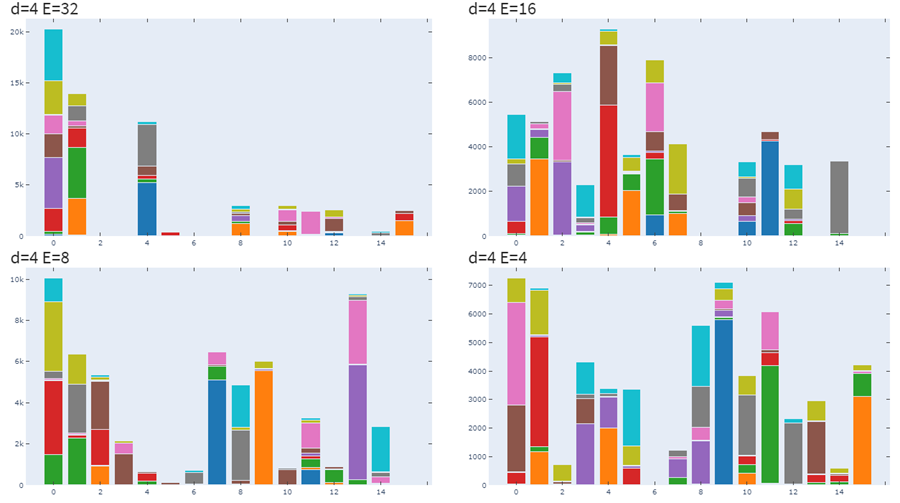
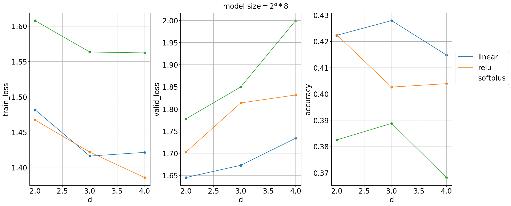
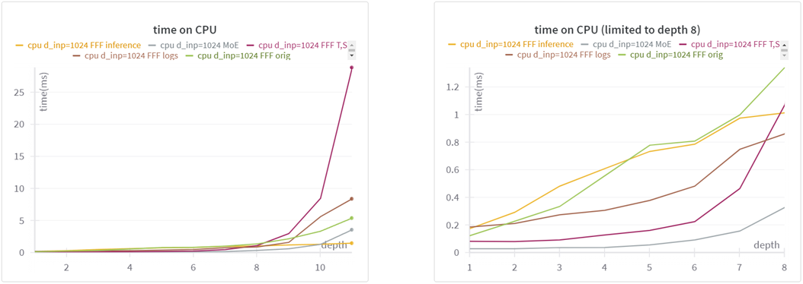

# FastFF


<!-- WARNING: THIS FILE WAS AUTOGENERATED! DO NOT EDIT! -->

This repository contains experiments comparing Mixture-of-Experts (MoE)
and Fast Feed-Forward (FFF) models introduced in FFF and UltraFastBert
papers ([author’s
repository](https://github.com/pbelcak/fastfeedforward)).

The `experiments` folder contains (almost) self-contained Jupyter
notebooks with benchmarks and experiments with the architecture.

The `FastFF` folder contains several implementations of the FFF model,
including the reference one, with additional tools to get data from
models and train them.

## Installation

Use pip or other package manager to install the package from this
repository

``` sh
pip install git+https://github.com/ssslakter/FastFF
```

## Results

The main results are:

- [SMEAR](http://arxiv.org/abs/2306.03745) gives slight improvements in
  the FFF model as well as MoE, although the hierarchical structure
  makes it harder to train. [Jupyter
  notebook](experiments/22-05-2024-Soft-merging.ipynb)

- Data distribution between experts shifts to the single peak when
  increasing the number of neurons in the experts. [Jupyter
  notebook](nbs/01_mnist.ipynb)

<figure>

<figcaption>
Distribution of data between $2^4$ experts for classification task with
10 classes
</figcaption>
</figure>

- FFF can be formulated as a MoE with a **sparse binary matrix** of
  transitions and additional activation function (*Softplus* in the
  reference formulation). Additional experiments show that linear
  activation function performs better. [Jupyter
  notebook](experiments/29-05-2024-FFF-activation.ipynb)

<figure>

</figure>

- With matrix formulation, the utilization of parallelism is higher than
  in the reference implementation, therefore for shallow layers there is
  a speedup. For deep layers the sequential branch selection becomes
  faster, when dense matrices require lots of space.[Jupyter
  notebook](experiments/23-04-2024-FFF-probs-benchmark.ipynb)

<figure>

</figure>
